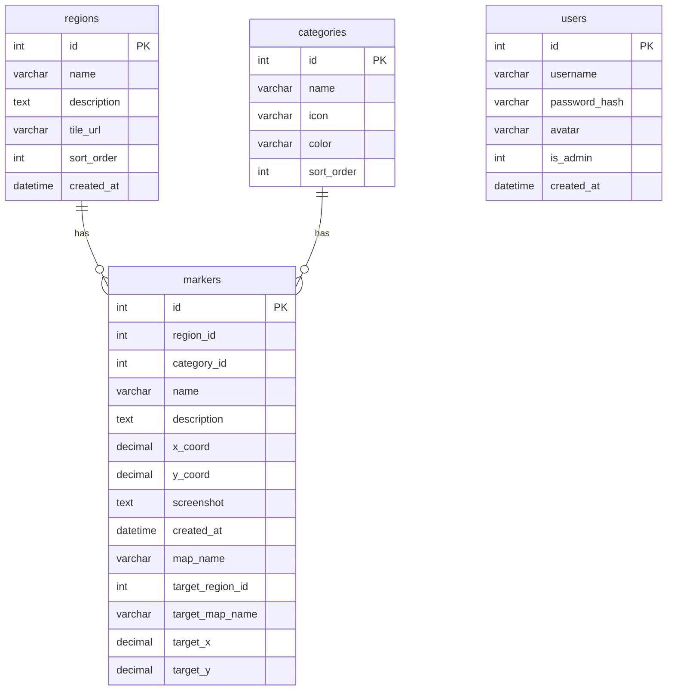

```mermaid
erDiagram
  categories {
    int id PK
    varchar name
    varchar icon
    varchar color
    int sort_order
  }
  markers {
    int id PK
    int region_id
    int category_id
    varchar name
    text description
    decimal x_coord
    decimal y_coord
    text screenshot
    datetime created_at
    varchar map_name
    int target_region_id
    varchar target_map_name
    decimal target_x
    decimal target_y
  }
  regions {
    int id PK
    varchar name
    text description
    varchar tile_url
    int sort_order
    datetime created_at
  }
  users {
    int id PK
    varchar username
    varchar password_hash
    varchar avatar
    int is_admin
    datetime created_at
  }
  regions ||--o{ markers : has
  categories ||--o{ markers : has
```